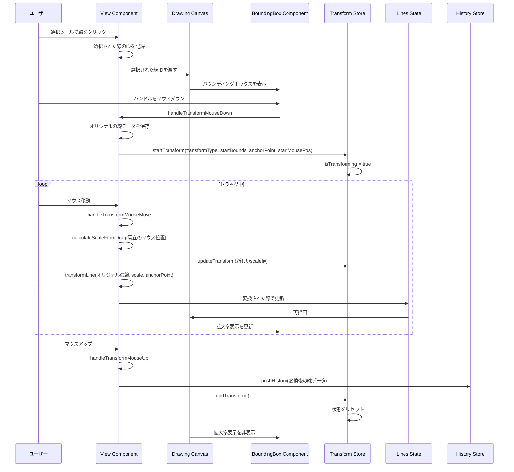

# バウンディングボックス仕様書

## 概要

選択ツールで線を選択した際に表示されるバウンディングボックスを使用して、選択された描画要素を拡大縮小する機能です。

## バウンディングボックスの表示

### 表示条件

- 選択ツールがアクティブな状態で線をクリックした時
- 複数の線が選択された場合は、全体を囲むバウンディングボックスを表示

### 表示要素

1. **境界線**: 選択された要素を囲む矩形の境界線（青色の破線）
2. **コーナーハンドル**: 四隅に配置され、アスペクト比を保った拡大縮小に使用
3. **拡大率表示**: 変形中に現在の拡大率を%で表示（黒い背景に白文字）

## ハンドル操作

### コーナーハンドル

- ドラッグで常にアスペクト比を保ったまま拡大縮小
- 対角のコーナーを基準点として拡大縮小
- 四隅のハンドルのみ（エッジハンドルなし）

### 操作中の表示

- リアルタイムでプレビューを表示
- 現在の拡大率を%で表示（バウンディングボックスの上部中央）

## 拡大縮小の実装

### データ変換

選択された線の座標を以下の手順で変換:

1. バウンディングボックスの中心を計算
2. 各ポイントを中心からの相対座標に変換
3. スケール値を適用
4. 絶対座標に戻す

### 制限事項

- 最小スケール: 10%
- 最大スケール: 1000%
- 極端に小さくなる場合は警告を表示

## UIデザイン

### 視覚的フィードバック

- バウンディングボックス: 青色の破線（#0066ff）
- ハンドル: 白背景に青い境界線の正方形（12x12px）
- ホバー時: ハンドルが大きくなる（16x16px）
- 拡大率表示: 黒い背景（rgba(0, 0, 0, 0.7)）に白文字

### カーソル

- コーナーハンドル: 対角リサイズカーソル（nwse-resize / nesw-resize）

## 状態管理

### 新しい状態

```typescript
interface TransformState {
  isTransforming: boolean;
  transformType: "scale" | "scaleX" | "scaleY" | null;
  startBounds: BoundingBox | null;
  currentScale: { x: number; y: number };
  anchorPoint: { x: number; y: number };
  startMousePos: { x: number; y: number } | null;
}

interface BoundingBox {
  x: number;
  y: number;
  width: number;
  height: number;
}
```

## 操作フロー

1. 選択ツールで線をクリック
2. バウンディングボックスが表示される
3. ハンドルをドラッグして拡大縮小
4. マウスを離すと変換を確定
5. 履歴に記録される

## バウンディングボックスの持続性

- 一度線をクリックしてバウンディングボックスが表示されると、以下のいずれかが発生するまで表示され続ける：
  - バウンディングボックスの外側をクリック
  - 別のツールに切り替え
  - ESCキーを押す（未実装）
- バウンディングボックスが表示されている間は、選択された線をドラッグして移動することも可能

## 拡大縮小処理のシーケンス図



### シーケンスの詳細説明

1. **線の選択**: ユーザーが選択ツールで線をクリックすると、その線とレイヤー上の全ての線が選択される
2. **バウンディングボックス表示**: 選択された線を囲むバウンディングボックスが計算・表示される
3. **変換開始**: ハンドルをクリックすると、オリジナルの線データが保存され、変換状態が開始される
4. **リアルタイム変換**: マウスドラッグ中は、アンカーポイントからの距離比率でスケール値を計算し、オリジナルの線データに適用
5. **変換確定**: マウスアップで変換が確定し、履歴に記録される
