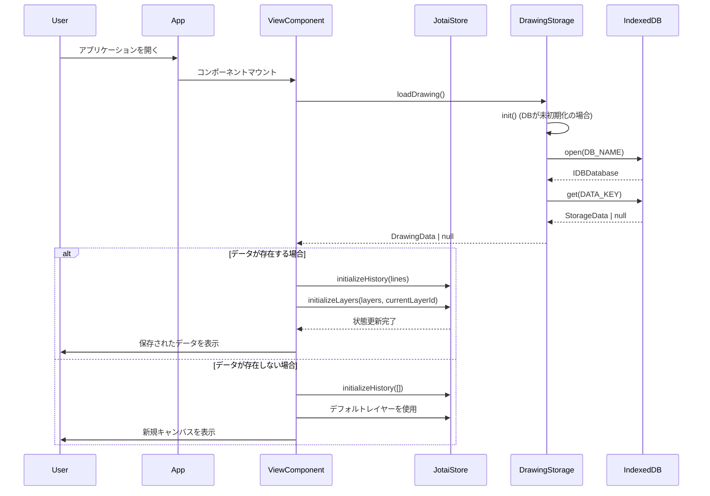
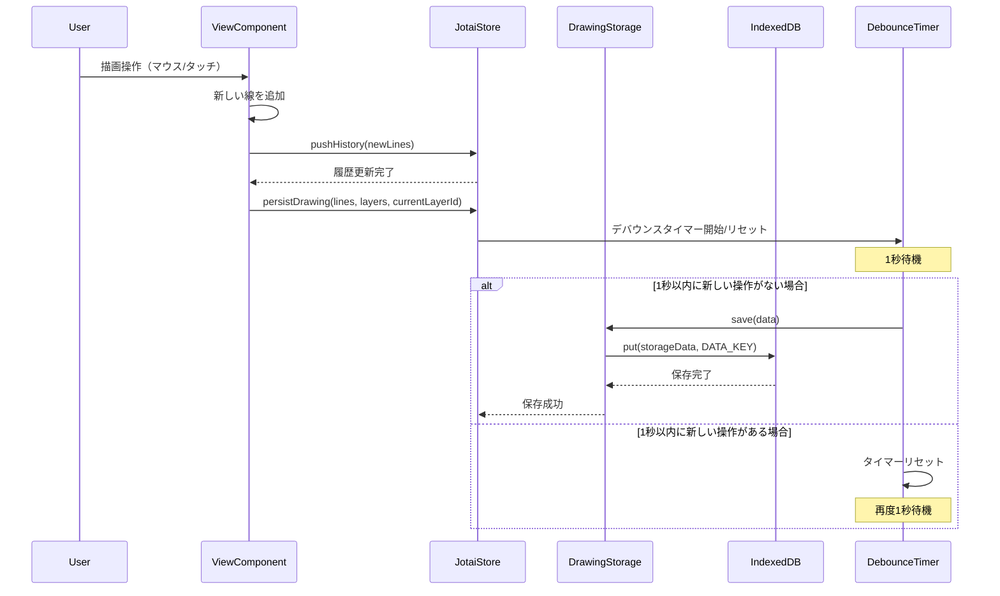
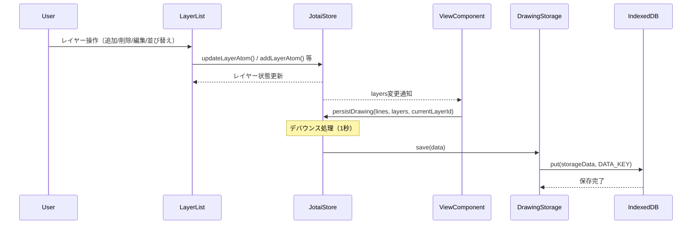
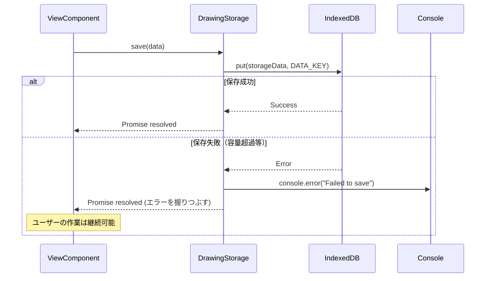

# データ永続化仕様書

## 概要

ブラウザを更新（リロード）しても描画データが保持される機能を実装する。ユーザーが描いた線、レイヤー情報、ツール設定などのデータをブラウザのストレージに保存し、再読み込み時に自動的に復元する。

## 目的

- ユーザーの作業内容の保護
- 意図しないブラウザリロードやクラッシュからの復旧
- 作業の一時中断と再開のサポート

## 保存対象データ

### 1. 描画データ

- `DrawingLine[]` - すべての描画ライン情報
  - id: string
  - points: number[]
  - color: string
  - strokeWidth: number
  - tool: "pen" | "eraser"
  - layerId: string

### 2. レイヤー情報

- `Layer[]` - すべてのレイヤー情報
  - id: string
  - name: string
  - visible: boolean
  - locked: boolean
  - opacity: number
- `currentLayerId` - 現在選択中のレイヤーID

### 3. ツール設定（オプション）

- 現在のツール
- ブラシサイズ
- ブラシカラー

### 4. 履歴情報（オプション）

- Undo/Redo履歴

## 使用ストレージ

IndexedDBを使用する。

## 処理フロー

### 1. 初期化・データ復元のシーケンス



### 2. 描画・自動保存のシーケンス



### 3. レイヤー操作と永続化のシーケンス



### 4. エラーハンドリングのシーケンス



## 実装方針

### 1. ストレージ管理モジュール

`src/lib/storage/drawing-storage.ts`を作成し、以下の機能を実装：

```typescript
interface DrawingData {
  lines: DrawingLine[];
  layers: Layer[];
  currentLayerId: string;
  version: string; // データフォーマットのバージョン
  timestamp: number; // 最終保存時刻
}

class DrawingStorage {
  // データの保存
  async save(data: DrawingData): Promise<void>;

  // データの読み込み
  async load(): Promise<DrawingData | null>;

  // データの削除
  async clear(): Promise<void>;

  // 自動保存の設定
  setupAutoSave(callback: () => DrawingData, interval: number): void;
}
```

### 2. Jotaiアトムの拡張

既存のアトムに永続化機能を追加：

```typescript
// src/stores/drawing-store.ts（新規作成）
export const drawingLinesAtom = atomWithStorage<DrawingLine[]>(
  "drawing-lines",
  [],
);
```

### 3. 自動保存機能

- デバウンス処理: 描画操作後、一定時間（例: 1秒）経過後に自動保存
- バックグラウンドで自動的に保存（ユーザーへの視覚的フィードバックなし）

### 4. データ復元

- アプリ起動時にストレージからデータを読み込み
- データが破損している場合のエラーハンドリング
- バージョン管理によるデータマイグレーション

## 実装手順

1. **ストレージモジュールの作成**
   - IndexedDBラッパークラスの実装
   - 保存・読み込み・削除機能の実装

2. **Jotaiアトムの永続化対応**
   - 描画データ用のアトムを作成
   - 既存のローカルステートをアトムに移行

3. **自動保存機能の実装**
   - デバウンス処理の実装
   - 保存タイミングの最適化

4. **UI/UXの改善**
   - データクリア機能の追加（設定画面など）

5. **エラーハンドリング**
   - ストレージ容量超過時の処理
   - データ破損時の復旧処理

## セキュリティ考慮事項

- 個人情報や機密データは保存しない
- ストレージデータの暗号化は不要（描画データのみ）

## パフォーマンス考慮事項

- 大量のポイントデータの効率的な保存
- 必要に応じて圧縮アルゴリズムの適用
- 保存処理の非ブロッキング化

## テスト計画

1. **単体テスト**
   - ストレージモジュールの各機能
   - データ変換処理

2. **統合テスト**
   - 描画→保存→リロード→復元のフロー
   - エラーケースの処理

3. **ブラウザ互換性テスト**
   - Chrome, Firefox, Safari, Edgeでの動作確認
   - モバイルブラウザでの動作確認

## 今後の拡張

- クラウドストレージとの連携
- 複数の作品の管理
- エクスポート/インポート機能
